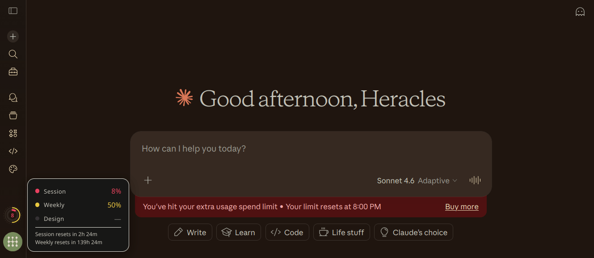

# [/staminai](https://heracl.es/staminai)

The AI token stamina wheel for [Claude](https://claude.ai).

A browser extension that floats a compact stamina wheel above your avatar in the Claude sidebar, showing your session, weekly, and Claude Design usage limits at a glance.

- [Website](https://heracl.es/staminai)
- [Source](https://git.heracl.es/staminai)
- [Firefox Add-ons](https://addons.mozilla.org/en-US/firefox/addon/staminai/)

## How it looks like

A circular widget with three concentric rings, located above the account avatar. Hover the wheel to see a tooltip with exact percentages and reset countdowns for all three limits.



Colors shift green → yellow → orange → red as you consume capacity. The center displays remaining session percentage — or `%` when at 100% (full stamina).

From outside in, the rings visualize:

| Ring | Style | Data |
|---|---|---|
| **Design** | Dotted, 1px | Claude Design weekly limit |
| **Weekly** | Solid, thin | 7-day rolling cap |
| **Session** | Solid, thick | 5-hour session window |

## When does it refresh?

- **On hover** — hovering the wheel triggers a refresh
- **On chatbox focus or click** — focusing or clicking the message composer refreshes (document-level event delegation — no observers, no polling)
- **On page load** — fetches once when Claude loads

All refreshes are debounced at 3 seconds and skipped entirely when the tab is backgrounded. The refresh indicator (spinning ring outside the wheel) shows when a fetch is in flight.

If Claude's API rate-limits us (HTTP 429), staminai backs off on a `1 min → 5 min → 15 min` ladder. 5xx responses trigger a 30-second cooldown. A `Retry-After` header overrides both if it asks for longer.

## Does this cost anything?

No. staminai reads the same metadata endpoint the Settings → Usage page uses:

```
GET /api/organizations/{orgId}/usage
```

This is a lightweight JSON call. No tokens are consumed, no API credits are spent.

## Install

> [!NOTE]
> Pending public listing in [Firefox Add-ons](https://addons.mozilla.org/en-US/firefox/addon/staminai/). Currently not published in Chrome / Edge Add-on stores.

### Firefox

1. Download `staminai-firefox.xpi` from [Releases](https://github.com/Arty2/staminai/releases)
2. Go to `about:debugging#/runtime/this-firefox`
3. Click **Load Temporary Add-on** → select the `.xpi`

For permanent install, you may self-sign with [`web-ext sign`](https://extensionworkshop.com/documentation/develop/web-ext-command-reference/#web-ext-sign).

### Chrome / Edge

1. Download `staminai-chromium.zip` from [Releases](https://github.com/Arty2/staminai/releases)
2. Unzip
3. Go to `chrome://extensions` → enable **Developer mode**
4. Click **Load unpacked** → select the unzipped folder

### Greasemonkey / Tampermonkey / Violentmonkey

1. Download `staminai.user.js` from [Releases](https://github.com/Arty2/staminai/releases)
2. Open it in a browser that has a userscript manager installed — the manager will prompt to install
3. Confirm install

No `@grant` permissions are required; CSS is injected as an inline `<style>` tag.

## Build from source

```bash
./build.sh
```

Produces `dist/staminai-firefox.xpi`, `dist/staminai-chromium.zip`, and `dist/staminai.user.js`.

Or build individually:

```bash
./build.sh firefox
./build.sh chromium
./build.sh userscript
```

## Project structure

```
staminai/
├── manifest.json     # MV3 manifest (Firefox + Chromium)
├── content.js        # Wheel logic, avatar anchoring, usage API
├── content.css       # Styling — uses Claude's own CSS variables
├── icons/            # Extension icons (16/32/48/128px)
├── screenshots/      # Browser screenshots
├── LICENSE           # MIT
├── build.sh          # Build script (MV3 zips + .user.js userscript)
├── CHANGELOG.md
└── README.md
```

## How it works

### Positioning

The extension finds the avatar button in Claude's sidebar via `button[data-testid*="user-menu-button"]` (partial-attribute match, so it survives minor `data-testid` renames). It reads `getBoundingClientRect()` and positions the wheel centered above the avatar at 72% of its diameter. Re-anchoring happens on page load, `window.resize`, wheel hover, and chatbox focus/click — there is no polling loop or `MutationObserver`.

### Theming

The tooltip uses Claude's own CSS custom properties — `--bg-200` for background, `--border-200` for borders, `--text-200` and `--text-300` for text. The wheel background uses `--bg-100`. This means staminai matches Claude's dark theme natively and won't break when they update their UI.

### Design ring

The outer dotted ring shows Claude Design usage. The API response is checked for `seven_day_design`, `design`, or `seven_day_opus` fields. When available, the ring lights up with the stamina color palette. When unavailable (the API field doesn't exist yet on your plan), the tooltip shows "—" and the ring remains a dim track.

## Permissions

| Permission | Why |
|---|---|
| `claude.ai/*` | Content script injection + usage API calls |

No background workers. No remote code. No storage. No cookies permission. Same-origin `fetch` with `credentials: "include"` reuses your existing Claude session.

## Privacy

- No data leaves your browser except to `claude.ai`
- No analytics, telemetry, or third-party calls
- No data is stored
- ~200 lines JS, ~80 lines CSS — fully auditable

## FAQ

**What does "%" mean in the wheel center?**
100% remaining — full stamina, no usage consumed yet.

**Why does the Design row show "—"?**
Claude hasn't exposed a separate Design quota in the usage API for your plan yet. The ring and tooltip will populate automatically when it appears.

**Does it work with all plans?**
Yes — Pro, Max, Team, Enterprise. The usage endpoint returns data for whatever plan your session is on.

## To-Do

Nothing outstanding right now — see [CHANGELOG.md](./CHANGELOG.md) for recent changes. File an issue if something's broken or missing.

***

Dialectic Acheiropoieton of Heracles Papatheodorou and Claude, MIT License
