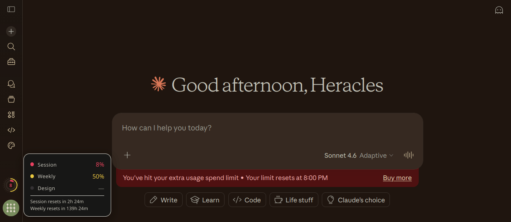

# /staminai

The AI token stamina wheel for [Claude](https://claude.ai).

A browser extension that floats a compact, draggable stamina wheel over Claude, showing your session and weekly usage limits at a glance.

- [Website](https://heracl.es/staminai)
- [Source](https://git.heracl.es/staminai)
- [Firefox Add-ons](https://addons.mozilla.org/en-US/firefox/addon/staminai/)

## How it looks like

A circular widget with three concentric rings, floating at the middle right of the window. Hover the wheel to see a tooltip with exact percentages and reset times for all three limits. Hold and drag it anywhere you like — it stays put across reloads.



Colors shift green → yellow → orange → red as you consume capacity. The wheel carries no text — the rings are the reading, and exact numbers live in the tooltip.

When the session or weekly limit is fully spent, the rings give way to an `HH:MM` countdown to the reset, since that's the only number left worth showing.

The whole widget is sized in viewport units (`clamp(28px, 2vw, 56px)`), so it scales with the window rather than sitting at a fixed pixel size.

From outside in, the rings visualize:

| Ring | Style | Data |
|---|---|---|
| **Weekly** | Solid, medium | 7-day rolling cap |
| **Session** | Solid, thick | 5-hour session window |

Each arc tapers to a round tip whose diameter matches its ring thickness.

## When does it refresh?

- **On hover** — hovering the wheel triggers a refresh
- **On chatbox focus or click** — focusing or clicking the message composer refreshes (document-level event delegation — no observers, no polling)
- **On page load** — fetches once when Claude loads

All refreshes are debounced at 3 seconds and skipped entirely when the tab is backgrounded. Nothing fetches on a timer. The refresh indicator (spinning ring outside the wheel) shows when a fetch is in flight.

If Claude's API rate-limits us (HTTP 429), staminai backs off on a `1 min → 5 min → 15 min` ladder. 5xx responses trigger a 30-second cooldown. A `Retry-After` header overrides both if it asks for longer.

## Does this cost anything?

No. staminai reads the same metadata endpoint the Settings → Usage page uses:

```
GET /api/organizations/{orgId}/usage
```

This is a lightweight JSON call. No tokens are consumed, no API credits are spent.

## Install

> [!NOTE]
> Pending public listing in [Firefox Add-ons](https://addons.mozilla.org/en-US/firefox/addon/staminai/). Currently not published in Chrome / Edge Add-on stores.

### Firefox

1. Download `staminai-firefox.xpi` from [Releases](https://github.com/Arty2/staminai/releases)
2. Go to `about:debugging#/runtime/this-firefox`
3. Click **Load Temporary Add-on** → select the `.xpi`

For permanent install, you may self-sign with [`web-ext sign`](https://extensionworkshop.com/documentation/develop/web-ext-command-reference/#web-ext-sign).

### Chrome / Edge

1. Download `staminai-chromium.zip` from [Releases](https://github.com/Arty2/staminai/releases)
2. Unzip
3. Go to `chrome://extensions` → enable **Developer mode**
4. Click **Load unpacked** → select the unzipped folder

### Greasemonkey / Tampermonkey / Violentmonkey

1. Download `staminai.user.js` from [Releases](https://github.com/Arty2/staminai/releases)
2. Open it in a browser that has a userscript manager installed — the manager will prompt to install
3. Confirm install

No `@grant` permissions are required; CSS is injected as an inline `<style>` tag.

## Build from source

```bash
./build.sh
```

Produces `dist/staminai-firefox.xpi`, `dist/staminai-chromium.zip`, and `dist/staminai.user.js`.

Or build individually:

```bash
./build.sh firefox
./build.sh chromium
./build.sh userscript
./build.sh clean
```

Every target runs a preflight check first, failing early if a source file or a manifest-referenced icon is missing. See [CLAUDE.md](./CLAUDE.md) for build-system and contribution notes.

## Project structure

```
staminai/
├── manifest.json     # MV3 manifest (Firefox + Chromium)
├── content.js        # Wheel logic, avatar anchoring, usage API
├── content.css       # Styling — uses Claude's own CSS variables
├── icons/            # Extension icons (16/32/48/128px)
├── screenshots/      # Browser screenshots
├── LICENSE           # MIT
├── build.sh          # Build script (MV3 zips + .user.js userscript)
├── CLAUDE.md         # Contributor guidance + browser add-on practices
├── CHANGELOG.md
└── README.md
```

## How it works

### Positioning

The wheel floats free. It is positioned in viewport coordinates and anchored to no element in Claude's DOM, so a Claude UI change can never strand it. It defaults to the middle right and can be dragged anywhere; drags under 4px still register as a click, so the tooltip toggle is unaffected.

The position is saved as a *fraction* of the available space rather than as raw pixels, so it restores proportionally at any window size and is clamped back on screen when the window shrinks. The tooltip flips to whichever side of the viewport has room and nudges itself vertically near the top and bottom edges.

### Scaling

The SVG lives in a fixed `0 0 100 100` coordinate space and is sized entirely by CSS via `--csw-size`. Every radius, stroke width and the center label are expressed as a percentage of the wheel, and the tooltip derives its type scale from `--csw-font` with `em` sizing throughout. Resizing the widget is a one-line CSS change; nothing is measured or resized in JavaScript.

### Theming

The wheel background uses Claude's own `--bg-100` custom property, so it follows Claude's theme. The tooltip uses a fixed palette matched to Claude's dark popovers (`--csw-tip-bg`, `--csw-tip-border`, `--csw-tip-text` on `#csw-tip`).

### Claude Design

Claude Design used to have its own weekly allowance, shown on a dotted outer ring. All Claude Design activity now counts toward your plan's shared limits, so the ring and its tooltip row are gone. The dotted ring is kept in the code, switched off, for a future separate meter or a credit balance.

## Permissions

| Permission | Why |
|---|---|
| `claude.ai/*` | Content script injection + usage API calls |

No background workers. No remote code. No storage. No cookies permission. Same-origin `fetch` with `credentials: "include"` reuses your existing Claude session.

## Privacy

- No data leaves your browser except to `claude.ai`
- No analytics, telemetry, or third-party calls
- The only thing stored is where you dragged the wheel — a single `localStorage` key (`staminai:pos`) holding two numbers. No usage data is ever persisted.
- ~640 lines JS, ~110 lines CSS — fully auditable

## FAQ

**Why does the wheel show a time instead of rings?**
Your session or weekly limit is fully spent. The `HH:MM` is how long until it resets.

**Can I move the wheel?**
Yes — hold click and drag it anywhere. Its position is remembered per browser.

**Where did the Design ring go?**
Claude Design no longer has its own allowance — its usage counts toward your plan's shared session and weekly limits, which the two rings already show.

**Does it work with all plans?**
Yes — Pro, Max, Team, Enterprise. The usage endpoint returns data for whatever plan your session is on.

## To-Do

Nothing outstanding right now — see [CHANGELOG.md](./CHANGELOG.md) for recent changes. File an issue if something's broken or missing.

***

Dialectic Acheiropoieton of Heracles Papatheodorou and Claude, MIT License
